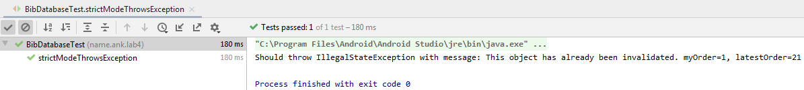
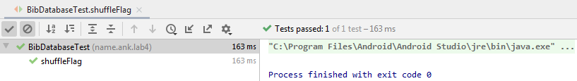
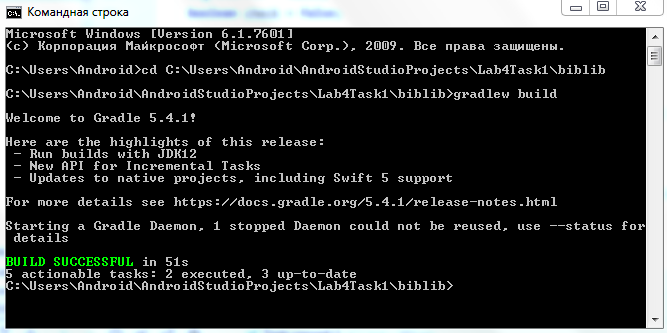
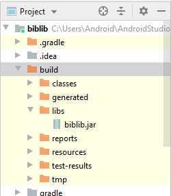
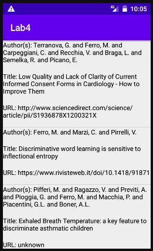

# Лабораторная работа №4. RecyclerView.
## Цели:
* Ознакомиться с принципами работы adapter-based views.
* Получить практические навыки разработки адаптеров для view.

## Задачи:
### Задача 1. Знакомсотво с библиотекой (unit test).
От меня требуется ознакомится с библиотекой biblib и написать тесты, проверяющие работоспособность strict mode (от обычного режима отличается тем, что в памяти нельзя хранить более maxValid записей одновременно, по умолчанию 20) и shuffle flag (При значении true перемешивает записи в случайном порядке).

В первом случае, наша цель - убедиться, что код действительно НЕ работает при попытке достать больше записей, чем указано в maxValid=20. Для этого переберём 20 + 1 запись в цикле, и удостоверимся, что первая запись стала невалидной:
```
  @Test
  public void strictModeThrowsException() throws IOException {
    BibDatabase database = openDatabase("/mixed.bib");
    BibConfig cfg = database.getCfg();
    cfg.strict = true;
    boolean check = false;
    BibEntry first = database.getEntry(0);

    for (int i = 0; i < cfg.maxValid; i++) {
      database.getEntry(0);
      try {
        Assert.assertNotNull("Should not throw any exception @" + i, first.getType());
      } catch (IllegalStateException exp) {
        System.out.println("Should throw IllegalStateException with message: " + exp.getMessage());
        check = true;
      }
    }
    Assert.assertTrue(check);
  }
```

Результат работы соответствует ожидаемому:



Далее, требуется проверить, что записи действительно перемешиваются при флаге shuffle=true. Для этого создадим две BibDatabase, перемешанную и нетронутую, и будем сравнивать их первые записи на предмет неравенства. Есть мизерная вероятность того, что первая запись останется на своём месте и проверка покажет равенство; поэтому повторим весь процесс 28 раз, чтобы свести случайность к минимуму.
```
 @Test
   public void shuffleFlag() throws IOException {
     BibConfig cfg = new BibConfig();
     cfg.shuffle = false;
     boolean check = false;
 
     for (int i = 0; i < 28; i++) {
       BibDatabase mixed = openDatabase("/mixed.bib");
       try (InputStreamReader reader =
                    new InputStreamReader(getClass().getResourceAsStream("/mixed.bib"))) {
 
         BibDatabase notMixed = new BibDatabase(reader, cfg);
         if (!mixed.getEntry(0).getField(Keys.AUTHOR)
                 .equals(notMixed.getEntry(0).getField(Keys.AUTHOR))) {
           check = true;
           break;
         }
 
       }
     }
     assertTrue(check);
   }
 }
```

Тестирование прошло успешно:



Последнее, что нужно сделать в этом пункте - создать библиотеку для использования в последующих заданиях:





### Задача 2. Знакомство с RecyclerView.
Я решу задачу обычной сложности - вывести на экран все записи из bibtex-файла, используя библиотеку из предыдущего пункта и RecyclerView. В файле все записи имеют одинаквый формат.

Первым делом была импортирована библиотка по алгоритму, указанному в официальной документации:

[Документация](https://developer.android.com/studio/projects/android-library#AddDependency "Добавление библиотеки")

Исходные данные помещены в res/raw. 

Листинг MainActivity.kt:
```
class MainActivity : AppCompatActivity() {
    override fun onCreate(savedInstanceState: Bundle?) {
        super.onCreate(savedInstanceState)

        val manager = LinearLayoutManager(this)
        val binding = ActivityMainBinding.inflate(layoutInflater)
        binding.recyclerView.addItemDecoration(DividerItemDecoration(this, manager.orientation))
        binding.recyclerView.layoutManager = manager
        binding.recyclerView.adapter = Adapter(resources.openRawResource(R.raw.articles))
        setContentView(binding.root)
    }
}
```

DividerItemDecoration не обязателен для функционирования устройства, однако, он помогает визуально различать записи.

Далее, для отображения информации на экране требуется Adapter и ViewHolder. В Adapter'е переопределим три ключевых метода: onCreateViewHolder(), onBindViewHolder() и getItemCount().
Листинг Adapter.kt:
```
class Adapter(base: InputStream) : RecyclerView.Adapter<Adapter.ViewHolder>() {
    private val reader = InputStreamReader(base)
    private val database = BibDatabase(reader)

    class ViewHolder(binding: ArticleBinding) : RecyclerView.ViewHolder(binding.root) {
        val author = binding.author
        val title = binding.title
        val url = binding.url
    }

    override fun getItemCount(): Int = database.size()

    override fun onCreateViewHolder(parent: ViewGroup, viewType: Int): ViewHolder {
        val inflater = LayoutInflater.from(parent.context)
        val binding = ArticleBinding.inflate(inflater, parent, false)
        return ViewHolder(binding)
    }

    override fun onBindViewHolder(holder: ViewHolder, position: Int) {
        val entry = database.getEntry(position)
        holder.author.text = "Author(s): " + entry.getField(Keys.AUTHOR) + "\n"
        holder.title.text = "Title: " + entry.getField(Keys.TITLE) + "\n"
        holder.url.text = "URL: " + (entry.getField(Keys.URL) ?: "unknown") + "\n"
    }
}
```

Layout activity_main будет состоять из одного RecyclerView.
Листинг activity_main.xml:
```
<?xml version="1.0" encoding="utf-8"?>
<androidx.constraintlayout.widget.ConstraintLayout xmlns:android="http://schemas.android.com/apk/res/android"
    xmlns:app="http://schemas.android.com/apk/res-auto"
    xmlns:tools="http://schemas.android.com/tools"
    android:layout_width="match_parent"
    android:layout_height="match_parent"
    tools:context=".MainActivity">

    <androidx.recyclerview.widget.RecyclerView
        android:id="@+id/recyclerView"
        android:scrollbars="vertical"
        android:layout_width="match_parent"
        android:layout_height="match_parent"/>
</androidx.constraintlayout.widget.ConstraintLayout>
```

Layout, отвечающий за отображение записей, будет показывать автора статьи, название и URL.
Листинг article.xml:
```
<?xml version="1.0" encoding="utf-8"?>
<LinearLayout xmlns:android="http://schemas.android.com/apk/res/android"
    android:layout_width="match_parent"
    android:layout_height="wrap_content"
    android:orientation="vertical"
    android:gravity="top">

    <TextView
        android:id="@+id/author"
        android:layout_width="match_parent"
        android:layout_height="wrap_content"
        android:textSize="14sp"
        android:textColor="@android:color/black"
        android:text="@string/author" />

    <TextView
        android:id="@+id/title"
        android:layout_width="match_parent"
        android:layout_height="wrap_content"
        android:textSize="14sp"
        android:textColor="@android:color/black"
        android:text="@string/title" />

    <TextView
        android:id="@+id/url"
        android:layout_width="match_parent"
        android:layout_height="wrap_content"
        android:textSize="14sp"
        android:textColor="@android:color/black"
        android:text="@string/url" />
</LinearLayout>
```

В итоге получили работоспособное приложение:



### Задача 3. Бесконечный список.
Модифицируем предыдущую задачу так, чтобы отображение записей было закольцовано.
Иными словами, "переопределим нумерацию"; для этого изменим getItemCount() и onBindViewHolder():
```
override fun getItemCount(): Int = Int.MAX_VALUE

override fun onBindViewHolder(holder: ViewHolder, position: Int) {
        val entry = database.getEntry(position % database.size())
        holder.author.text = "Author(s): " + entry.getField(Keys.AUTHOR) + "\n"
        holder.title.text = "Title: " + entry.getField(Keys.TITLE) + "\n"
        holder.url.text = "URL: " + (entry.getField(Keys.URL) ?: "unknown") + "\n"
    }
```

Таким образом, позиция записи в Layout'e будет повторяться.

Дополнительно, можно убрать полосу прокрутки 'android:scrollbars="vertical"' из activity_main.xml, поскольку при "бесконечном" списке она не имеет смысла.

## Вывод:

Я узнал о библиотеке bibTeX и возможностях её настройки (Флаг shuffle перемешивает записи, флаг strict вводит искуственное ограничение на maxValid влаидных записей), поработал с RecyclerView (удобен для отображения больших массивов данных), ознакомился с принципами работы adapter-based views и получил практические навыки разработки адаптеров для view.
